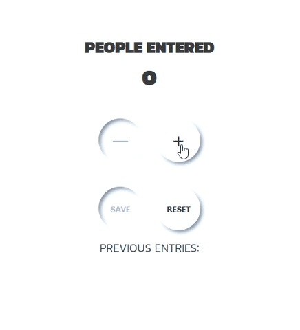

# Passenger-counter-app
JavaScript exercise from Scrimba

Original exercise is only with "increment" and "save" buttons together with JS functionality that goes along with those features. 
I added "decrement" and "reset" buttuns to make the app more functional. 

